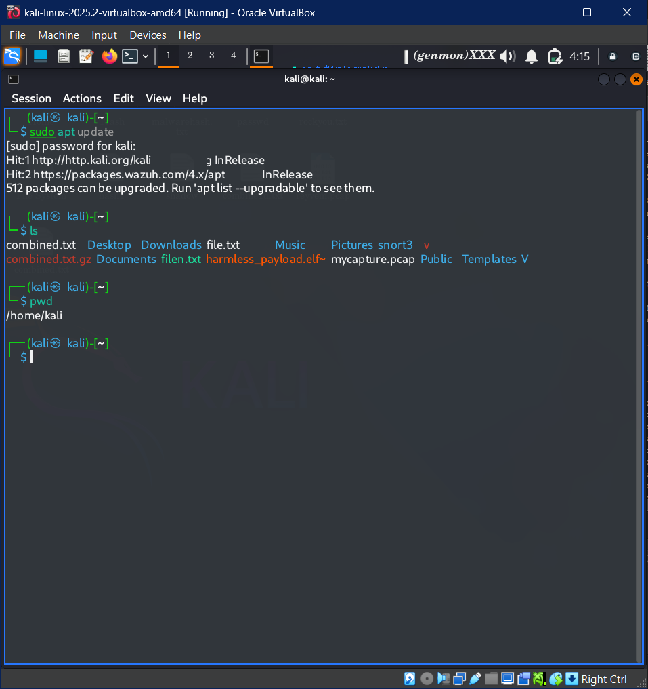
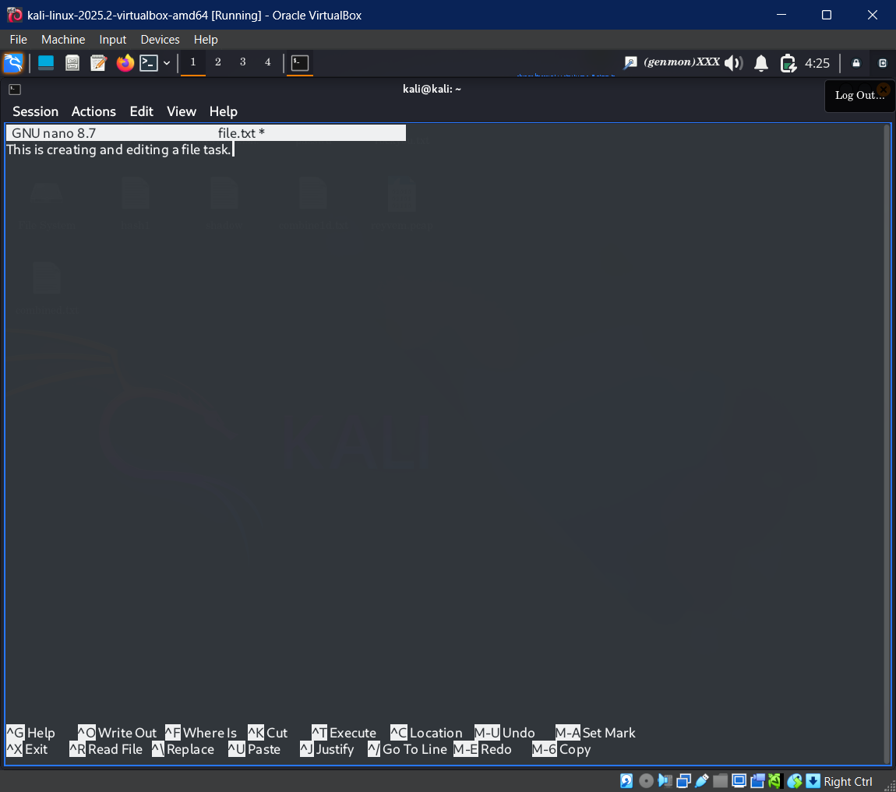
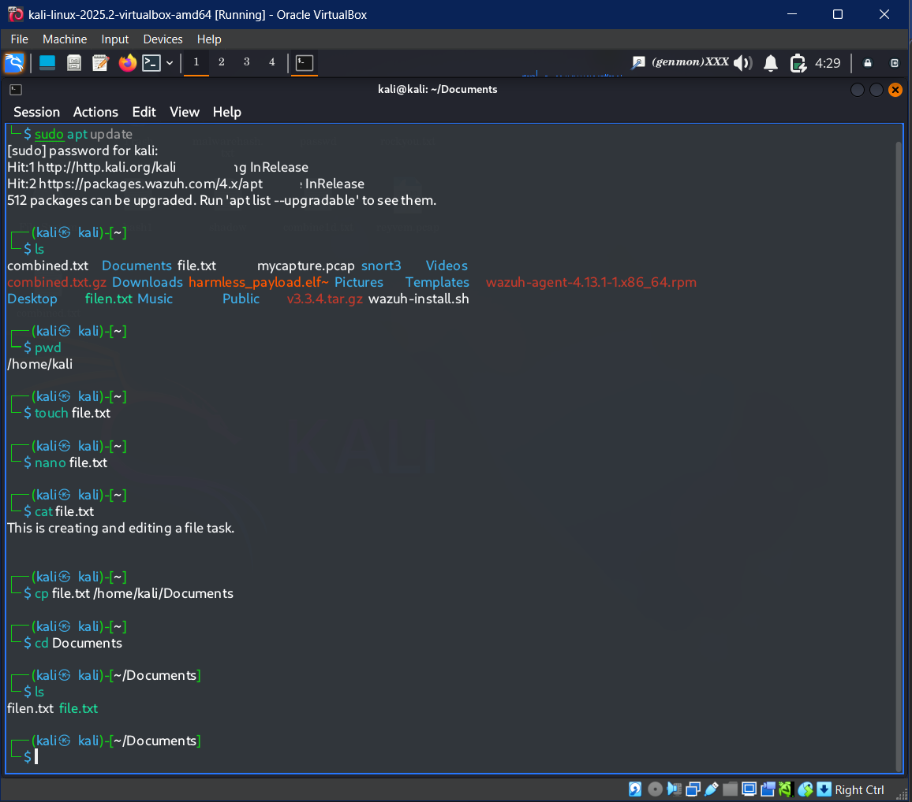
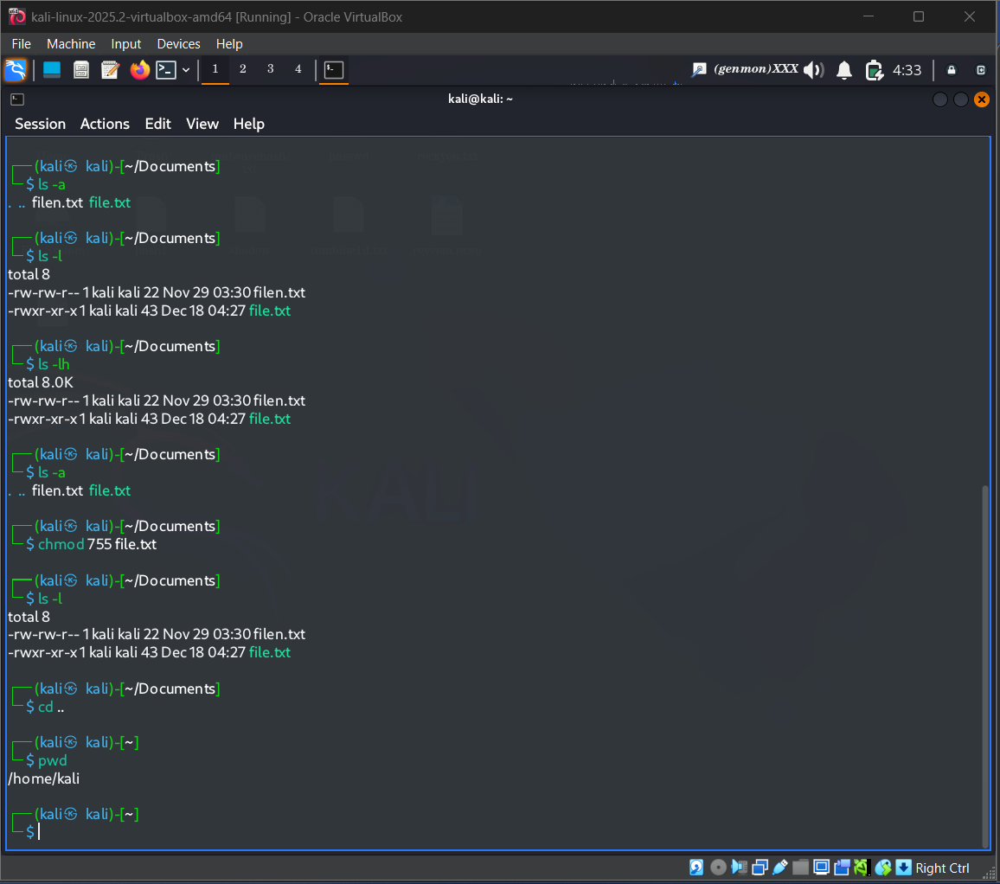
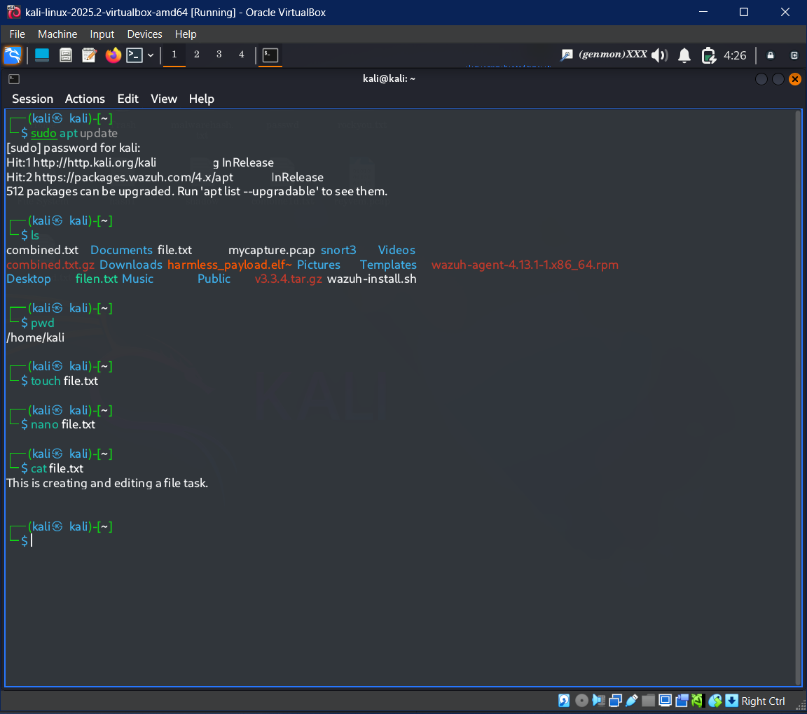

# Lab Report: Linux Terminal Basics

## Objective
Demonstrate proficiency in Linux command-line operations, including file system navigation, file manipulation, and the management of user permissions.

---

## Task 1: Environment Exploration & System Readiness

### Package Index Update
**Command:**
```bash
sudo apt update
```

**Observation:**
- Synchronized the local package index with remote repositories.
- The system identified `512 packages eligible for upgrade.`



### Directory Listing & Path Verification
**Commands:**
```bash
pwd
ls
```

**Observation:**
- Verified the current working directory as `/home/kali`.
- The `ls` command revealed standard directory structures like `Documents/`, `Desktop/`, and others.


---

## Task 2: File Lifecycle Management

### File Initialization and Modification
**Commands:**
```bash
touch file.txt
nano file.txt
```

**Observation:**
- Created a blank file (`file.txt`).
- Used the `nano` editor to insert the string:  
  "This is creating and editing a file task."



### Data Integrity Check & Redundancy
**Commands:**
```bash
cat file.txt
cp file.txt ~/Documents/
```

**Observation:**
- Validated file content: "This is creating and editing a file task." via `cat`.
- Successfully copied `file.txt` into the `Documents` directory.



---

## Task 3: Security & Permission Metadata

### Extended Attribute Analysis
**Command:**
```bash
ls -lah
```

**Observation:**
- Displayed hidden files and human-readable file sizes.
- Initial permissions for `file.txt`: 666 (`-rw-rw-r--`).



### Modifying Access Control Lists (ACL)
**Command:**
```bash
chmod 755 file.txt
ls -l file.txt
```

**Observation:**
- Elevated permissions to 755 (`-rwxr-xr-x`), granting execution rights to the owner while maintaining read/execute rights for others.


---

## Challenges & Resolution

| **Challenge**              | **Technical Cause**                                          | **Solution**                                      |
|---------------------------|--------------------------------------------------------------|---------------------------------------------------|
| Directory ambiguity       | Created initial assets in `$HOME` instead of `Documents`     | Used `cp` for duplication and `ls` for verification |
| Permissions understanding | Confusion between numeric (755) and symbolic representations | Cross-referenced `ls -l` for clarification        |

---

## Conclusion
This lab demonstrated:
- Efficient file management using `touch`, `nano`, `cat`, and `cp`.
- Effective use of permissions via `chmod` with validation using `ls -lah` and `ls -l`.
- Navigation and exploration of the Linux file system through `cd`, `pwd`, and directory inspection commands (`ls`, `ls -lah`).

---

## Attached Screenshots

1. **System Update:** `sudo apt update`, `ls`, `pwd`  
   

2. **File Creation and Editing:** `nano file.txt`  
   

3. **File Content Validation:** `cat file.txt`  
   

4. **File Copy Verification:** `cp file.txt ~/Documents`, `ls ~/Documents`  
   

5. **Permission Update Verification:** `chmod 755 file.txt`, `ls -l file.txt`  
   